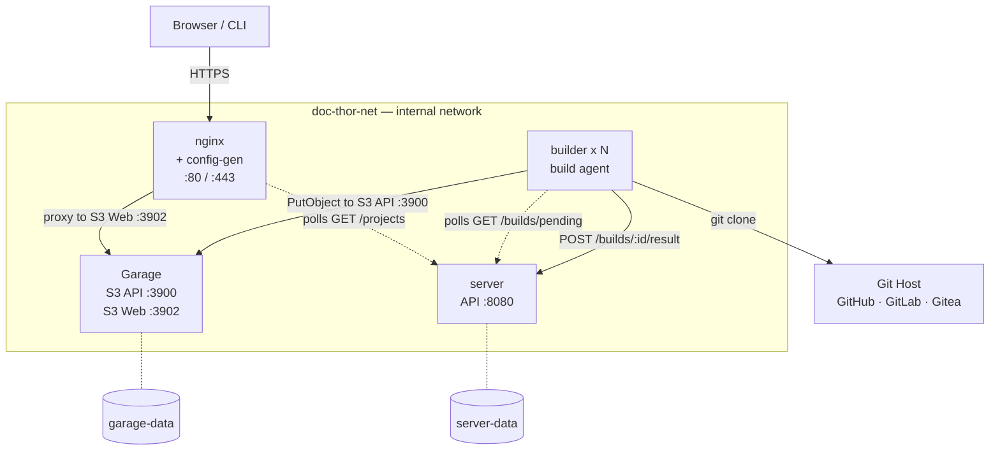
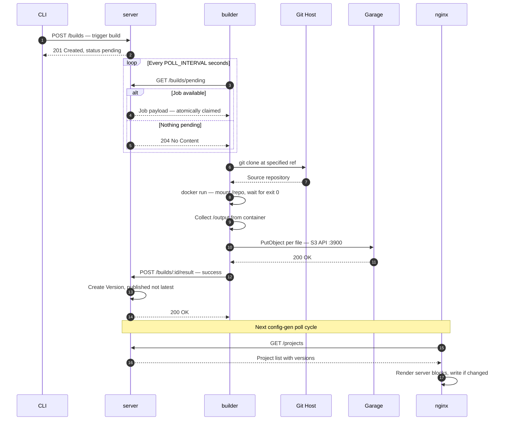
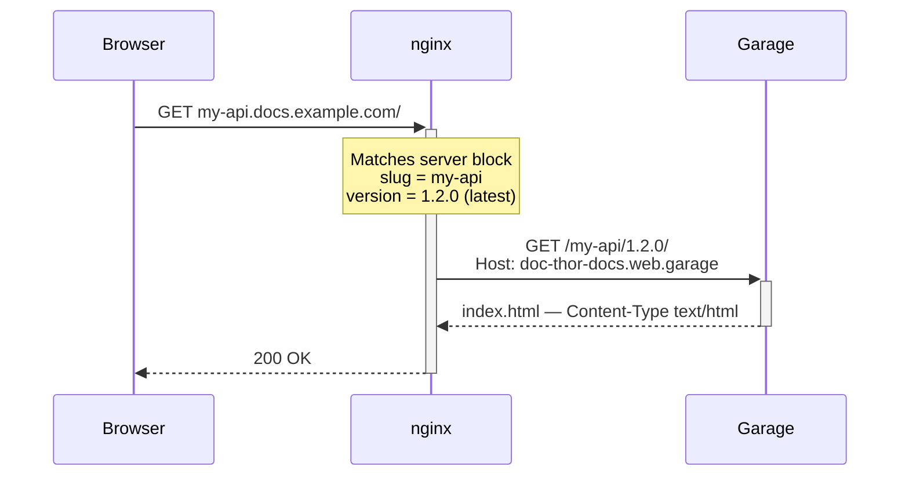

# Diagrams

Visual references for how the system fits together. No diagram will make this
obvious on first glance. These help on second glance.

> **Note:** These diagrams use Mermaid. If they don't render, your MkDocs setup
> needs the `pymdownx.superfences` extension with the mermaid fences configured.
> Don't look at us — that's an MkDocs problem.

---

## Deployment topology

How the services are laid out at runtime. Single Docker network. Only nginx
talks to the outside world. Everything else is internal.

Solid lines are active data transfers. Dotted lines are polling relationships.
The two cylinders at the bottom are the only persistent volumes — the only things
you actually need to back up.

---

## Build pipeline

What happens from the moment someone triggers a build to the moment docs are live.
The loop at the top is the polling gap — it closes itself every `POLL_INTERVAL` seconds.
The rest is sequential. If any stage fails, the pipeline stops and reports back.

---

## Serving a request

What happens when a browser hits a doc subdomain. Three hops. No database query.
No application server in the critical path. Just Nginx reading a routing table
and Garage serving a file.

